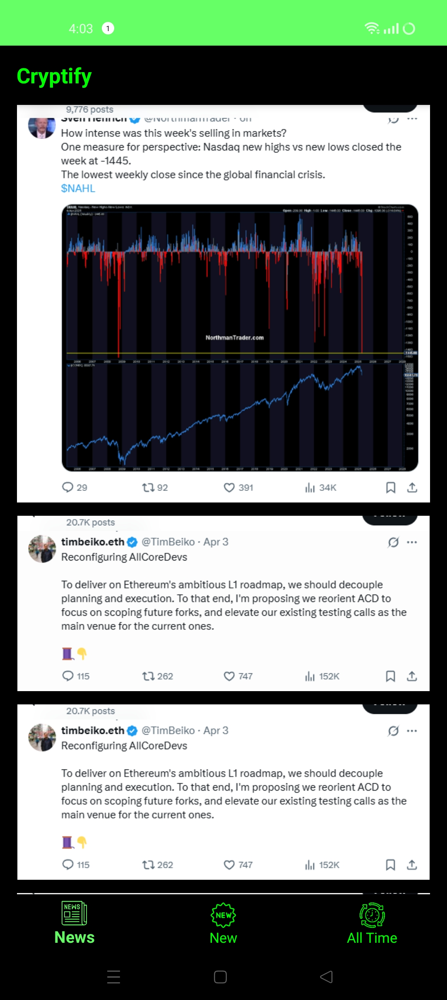
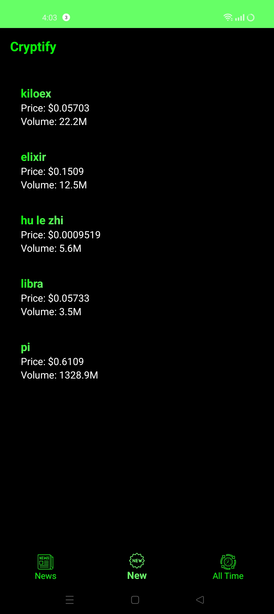
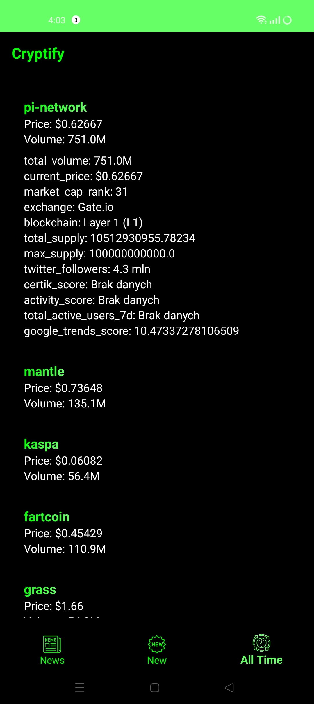
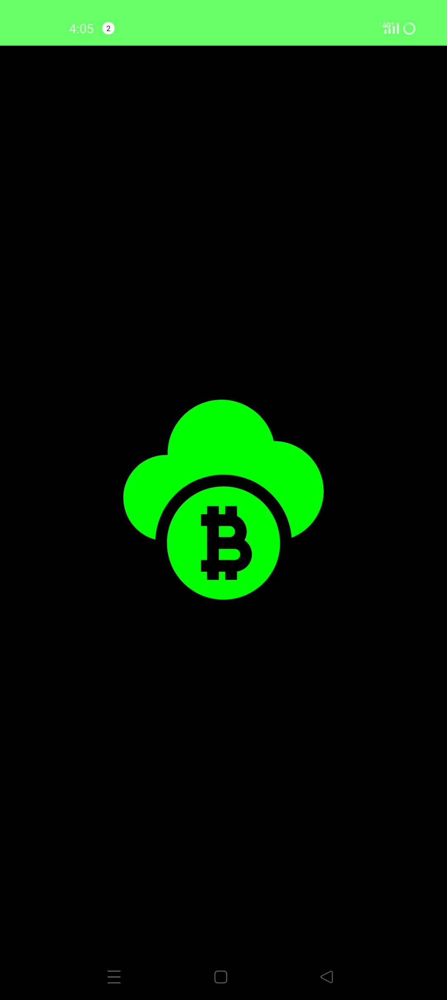

# 🚀 Cryptify 📱

Your gateway to the most explosive crypto news & tokens with moonshot potential! 🌕📈

Cryptify is a sleek mobile app that brings you:

📰 Top trending news from X (formerly Twitter) — stay ahead of the curve

💎 Hidden gem tokens — both new and established, filtered through smart algorithms

🔍 Advanced signal filtering — we scan, sort & score tokens for potential listings on Binance

⚡️ High growth alerts — identify coins that can skyrocket up to 8000% in just hours

## 💸 100% Free. Just run it.
No subscriptions, no hidden fees – just download the app and run the API server locally on your own machine. You're in control 🧠🖥️


# 🚀 How to Set Up Cryptify (Backend + App)

Follow these simple steps to get Cryptify running locally on your device! 🛠️📱

---

## 🔧 1. Download & Set Up XAMPP
XAMPP will act as your local server.

- 👉 [Download XAMPP here](https://www.apachefriends.org/index.html)
- 📁 After installing, go to the `htdocs` folder (usually at `C:\xampp\htdocs`)
- 📂 Create a new folder (e.g. `cryptify_api`) inside `htdocs`
- 📥 Copy the following files into that folder:

```
api.php
analiza.py
analiza_2.py
coin_market.py
timer.py
```

- 📝 Before running the app, you need to provide your X (Twitter) account login details in the `analiza.py`
- 🕒 `timer.py` is responsible for periodically executing the other `.py` files to ensure the data is always up to date.
- 🚨 This script **must be running continuously** in the background.
- 💡 You can configure your system to **automatically launch `timer.py` on startup** by placing a shortcut to it in the Startup folder on Windows:

```
Win + R → shell:startup → Paste shortcut to timer.py
```

---

## 🧠 2. Configure Your API Folder in the App

Navigate to:
```
D:\python files\krypto_app\app\src\main\java\com\example\krypto_app\network\ApiService.kt
```

- 📝 Edit the file and enter the name of the folder you just created in XAMPP (`cryptify_api`, or your custom name).

---

## ▶️ 3. Start the Apache Server

- Open XAMPP
- Click **Start** next to **Apache** 🟢

---

## 🌐 4. Set Up ngrok (To Make Your Local Server Public)

- 👉 [Download ngrok here](https://ngrok.com/download)
- Or install via Chocolatey:

```bash
choco install ngrok
```

- Once installed, run ngrok in your terminal (pointing to Apache default port 80):

```bash
ngrok http 80
```

- 📎 This will generate a public link like:

```
https://a1b2c3d4e5f6.ngrok.io
```

---

## 🛠️ 5. Paste Your ngrok Link in the App

Navigate to:
```
D:\python files\krypto_app\app\src\main\java\com\example\krypto_app\network\RetrofitClient.kt
```

- 🔗 Replace the current base URL with your **ngrok link** (make sure it ends with a `/`).

---

## 🤖 6. Build the Android App

1. 📥 Download [Android Studio](https://developer.android.com/studio)
2. Open the project (`krypto_app`) in Android Studio
3. Let Gradle sync (automatically or click **Sync Now**)
4. Connect your Android device via USB (with **Developer Mode ON**)
5. Click **Build & Run** ▶️

---

## 🎉 That’s it!
The app will start running on your phone and fetch live data from your local API.

> ⚠️ **Note:** The app will continue working as long as your **ngrok** server is active. If you stop ngrok or turn off XAMPP, data updates will stop.
> 
> 🔁 Also make sure `timer.py` is always running to keep the backend data fresh!

## 📸 Screenshots

Here are some example images of the app in action:







